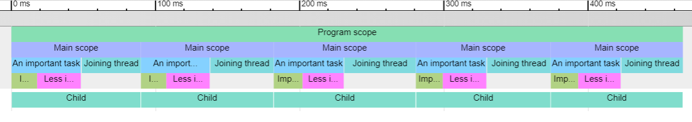

# gbench

This crate provides the tools to benchmark code for further analyzation using Chrome tracing. The crate is purely rust and has no dependencies.

# Example

For more examples and a guide on how to use please visit the [documentation](https://docs.rs/gbench)

```rust
use std::thread;

use gbench::{instantiate, scope};

fn calculate(num: f32, n: u32) -> f32 {
    (0..n)
        .fold((num, 0.0), |(x, v), _| (x + v * 0.01, v - x * 0.001))
        .0
}

fn main() {
    // Istantiation of the global variables
    // It is needed at the top of every program that uses gbench
    // The folder that is specified is the folder where the data
    // will be saved
    instantiate!("target/bench");

    // Starting the main scope of the whole program
    scope!(program_scope | "Program scope");

    // Doing the work that needs benchmarking
    for _ in 0..5 {
        // Marking the start of the subprogram scope
        scope!(main | "Main scope");

        // Spawning a thread to do work
        let thread = thread::spawn(move || {
            // This benchmarks the scope that it is in
            scope!(child | "Child");

            calculate(1.0, 1_500_000)
        });

        // You can organize your subtasks in scopes to
        // benchmark them
        scope!(imp | "An important task");

        {
            scope!(i1 | "Important subtask");
            calculate(1.0, 300_000);
        }

        {
            scope!(i2 | "Less important subtask");
            calculate(1.0, 500_000);
        }

        // If the block of code that you need to benchmark
        // has ended you can drop the guard if the scope
        // has not ended
        drop(imp);

        // Marking the start of another task
        scope!(join | "Joining thread");

        thread.join().unwrap();

        // This line of code is unnecessary but I like
        // to keep it
        drop(join);
    }
}
```

The code above produces this trace



# Links

- [crates.io](https://crates.io/crates/gbench)
- [chrome tracing docs](https://docs.google.com/document/d/1CvAClvFfyA5R-PhYUmn5OOQtYMH4h6I0nSsKchNAySU/preview)
- [crate documentation](https://docs.rs/gbench)
